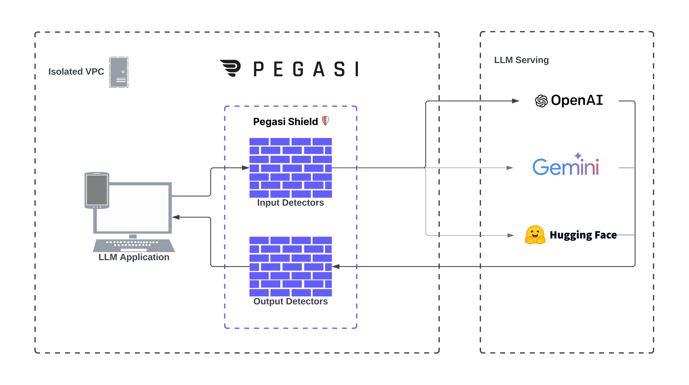
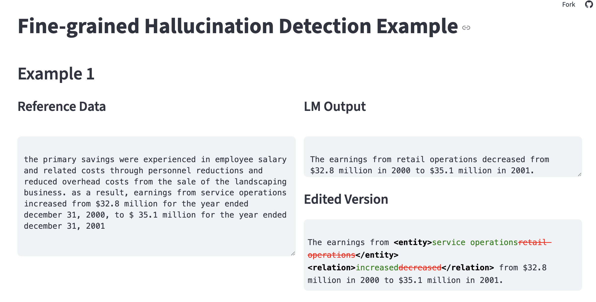

# 🛡️ Pegasi Shield 
[](https://opensource.org/licenses/Apache-2.0)
[](https://www.python.org/downloads/release/python-370/)
[](https://github.com/psf/black)
[](https://pypi.org/project/guardrail-ml)
[](https://pepy.tech/project/guardrail-ml)
[](https://icml.cc/)



*A lightweight safety and reliability layer for large‑language‑model (LLM) applications.*

---

## Overview

Pegasi Shield sits between your application and any LLM (OpenAI, Claude, local models, etc.).  
It inspects every prompt and response, blocks or edits unsafe content, and logs decisions for auditing—all with minimal latency and no data egress.

<a href="https://colab.research.google.com/drive/17Dq4ClbxI-AIjpQM2MxiLeoLnmfxTqrR?usp=sharing"
   target="_blank" rel="noopener noreferrer">
  
</a>
---

## 🔬 Research: FRED

Pegasi Shield’s hallucination module is powered by **FRED — Financial Retrieval‑Enhanced Detection & Editing**.
The method was peer‑reviewed and accepted to the *ICML 2025 Workshop*.
Code, evaluation harness and demo notebooks are in `fred/`.



<a href="https://pegasi-fred-demo-v1.streamlit.app/"
   target="_blank" rel="noopener noreferrer">
  
</a>

<a href="https://arxiv.org/abs/2507.20930"
   target="_blank" rel="noopener noreferrer">
  
</a>
---

## 🔧 Key capabilities

| Area | What Shield provides |
|------|----------------------|
| **Prompt security** | Detects and blocks prompt injections, role hijacking, system‑override attempts. |
| **Output sanitisation** | Removes personal data, hate speech, defamation and other policy violations. |
| **Hallucination controls** | Scores and rewrites ungrounded text using a 4B parameter model at performance on par with o3. |
| **Observability** | Emits structured traces and metrics (OpenTelemetry) for dashboards and alerts. |
| **Deployment** | Pure‑Python middleware, Docker image, or Helm chart for Kubernetes / VPC installs. |

---

## ⚡ Quick start

*Coming July 25th

```bash
pip install pegasi-shield
````

```python
from pegasi_shield import Shield
from openai import OpenAI

client = OpenAI()
shield = Shield()                       # uses default policy

messages = [{"role": "user", "content": "Tell me about OpenAI o3"}]
response = shield.chat_completion(
    lambda: client.chat.completions.create(model="gpt-4.1-mini", messages=messages)
)

print(response.choices[0].message.content)
```

*`Shield.chat_completion` accepts a callable that runs your normal LLM request.
Shield returns the same response object—or raises `ShieldError` if the call is blocked.*

---

## 📚 How it works

1. **Prompt firewall** — lightweight rules (regex, AST, ML) followed by an optional LLM check.
2. **LLM request** — forwards the original or patched prompt to your provider.
3. **Output pipeline**

   * heuristics → vector similarity checks → policy LLM
   * optional “Hallucination Lens” rewrite if factuality score is below threshold.
4. **Trace** — JSON event with allow/block/edit decision and risk scores.

All stages are configurable via YAML or Python.

---

## Roadmap

* v0.5 launch (July 18th)
* LiveKit Agent Tutorial
* LangGraph Agent Tutorial
* Fine‑grained policy language 
* Streaming output inspection
* JavaScript/TypeScript SDK

---

## Contributing

Issues and pull requests are welcome. See `CONTRIBUTING.md` for details.

---

## License

Apache 2.0

```
::contentReference[oaicite:0]{index=0}
```
